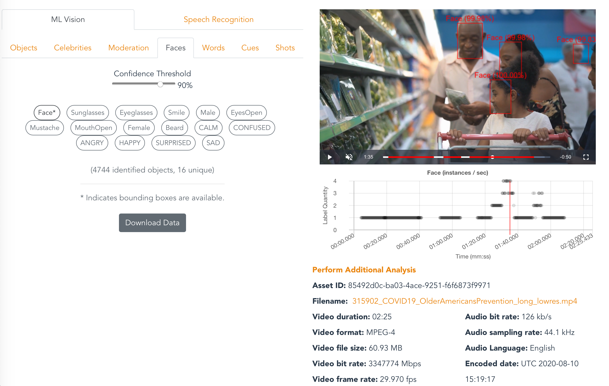
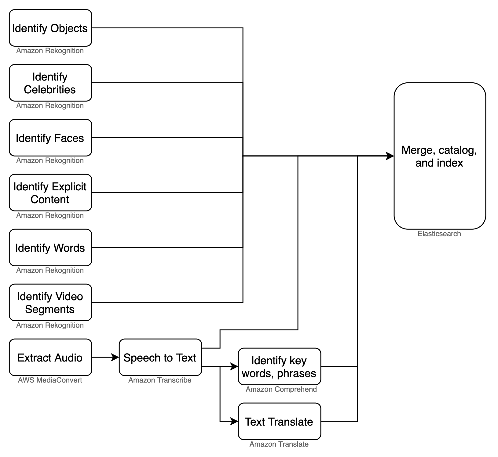

# MEDIA INSIGHTS APPLICATION

This application, designed to be a reference application for the [Media Insights Engine](https://github.com/awslabs/aws-media-insights-engine) (MIE), catalogs videos and images with data generated by AWS AI services for computer vision and speech detection. A graphical user interface (GUI) enables users to search through the catalog to find videos or images containing certain content and to analyze what the cataloged data looks like for selected files.



# INSTALLATION

## One-click deploys

The MIE framework must be installed in your AWS account before installing this front-end application.

#### *Option 1:* Install over an existing MIE instance

If you already have MIE deployed in your account, then use the following buttons to deploy this front-end application:

Region| Launch
------|-----
US East (N. Virginia) | [](https://console.aws.amazon.com/cloudformation/home?region=us-east-1#/stacks/new?stackName=mie&templateURL=https://rodeolabz-us-east-1.s3.amazonaws.com/content-analysis-solution/beta01/cf/aws-content-analysis.template)
US West (Oregon) | [](https://console.aws.amazon.com/cloudformation/home?region=us-west-2#/stacks/new?stackName=mie&templateURL=https://rodeolabz-us-west-2.s3.amazonaws.com/content-analysis-solution/beta01/cf/aws-content-analysis.template)

#### *Option 2:* Install with a new MIE instance

If you DO NOT have MIE deployed in your account, then use the following buttons to deploy both MIE and this front-end application. This will deploy a prebuilt version of the most recent MIE release.

Region| Launch
------|-----
US East (N. Virginia) | [](https://console.aws.amazon.com/cloudformation/home?region=us-east-1#/stacks/new?stackName=mie&templateURL=https://rodeolabz-us-east-1.s3.amazonaws.com/content-analysis-solution/beta01/cf/aws-content-analysis-deploy-mie.template)
US West (Oregon) | [](https://console.aws.amazon.com/cloudformation/home?region=us-west-2#/stacks/new?stackName=mie&templateURL=https://rodeolabz-us-west-2.s3.amazonaws.com/content-analysis-solution/beta01/cf/aws-content-analysis-deploy-mie.template)

## Build from scratch

The MIE framework must be installed in your AWS account before installing this  application. The following commands will build and deploy this application with a prebuilt version of the most recent MIE release. Be sure to define values for `EMAIL`, `WEBAPP_STACK_NAME`, and `REGION` first.

```
git clone https://github.com/awslabs/aws-media-insights
cd aws-media-insights
git checkout old_dev_webapp_merge
cd deployment
REGION=[specify a region]
DATETIME=$(date '+%s')
DIST_OUTPUT_BUCKET=media-insights-engine-frontend-$DATETIME
aws s3 mb s3://$DIST_OUTPUT_BUCKET-$REGION --region $REGION
./build.sh $DIST_OUTPUT_BUCKET-$REGION $VERSION $REGION
EMAIL=[specify your email]
WEBAPP_STACK_NAME=[specify a stack name]
TEMPLATE={copy "Without existing MIE deployment" link from output of build script}
aws cloudformation create-stack --stack-name $WEBAPP_STACK_NAME --template-url $TEMPLATE --region $REGION --parameters ParameterKey=MieStackName,ParameterValue=$MIE_STACK_NAME ParameterKey=AdminEmail,ParameterValue=$EMAIL --capabilities CAPABILITY_IAM CAPABILITY_NAMED_IAM CAPABILITY_AUTO_EXPAND --profile default --disable-rollback
```
When finished your stack should look like this:


# Analysis Workflow

After uploading a video or image in the GUI, the application runs a workflow in MIE that extracts insights using a variety of media analysis services on AWS and stores them in a search engine for easy exploration. The following flow diagram illustrates this workflow:



* Proxy encode of videos and separation of video and audio tracks using **AWS Elemental MediaConvert**. 
* Object and activity detection in images and video using **Amazon Rekognition**. 
* Celebrity detection in images and video using **Amazon Rekognition**
* Face search from a collection of known faces in images and video using **Amazon Rekognition**
* Facial analysis to detect facial features and faces in images and videos to determine things like happiness, age range, eyes open, glasses, facial hair, etc. In video, you can also measure how these things change over time, such as constructing a timeline of the emotions expressed by an actor.  From **Amazon Rekognition**.
* Unsafe content detection using **Amazon Rekognition**. Identify potentially unsafe or inappropriate content across both image and video assets.
* Detect text in videos and images using **Amazon Rekognition**.
* Video segment detection using **Amazon Rekognition**. Identify black frames, color bars, end credits, and scene changes.
* Identify start, end, and duration of each unique shot in your videos using **Amazon Rekognition.** 
* Convert speech to text from audio and video assets using **Amazon Transcribe**.
* Convert text from one language to another using **Amazon Translate**.
* Identify entities in text using **Amazon Comprehend**. 
* Identify key phrases in text using **Amazon Comprehend**

Users can enable or disable operators in the upload view shown below:


# Search Capabilities:

The search field in the Collection view searches the full media content database in Elasticsearch. Everything you see in the analysis page is searchable. Even data that is excluded by the threshold you set in the Confidence slider is searchable. Search queries must use valid Lucene syntax.

Here are some sample searches:

* Since Content Moderation returns a "Violence" label when it detects violence in a video, you can search for any video containing violence simply with: `Violence`
* Search for videos containing violence with a 80% confidence threshold: `Violence AND Confidence:>80` 
* The previous queries may match videos whose transcript contains the word "Violence". You can restrict your search to only Content Moderation results, like this: `Operator:content_moderation AND (Name:Violence AND Confidence:>80)`
* To search for Violence results in Content Moderation and guns or weapons identified by Label Detection, try this: `(Operator:content_moderation AND Name:Violence AND Confidence:>80) OR (Operator:label_detection AND (Name:Gun OR Name:Weapon))`  
* You can search for phrases in Comprehend results like this, `PhraseText:"some deep water" AND Confidence:>80`
* To see the full set of attributes that you can search for, click the Analytics menu item and search for "*" in the Discover tab of Kibana.

# Developers

Join our Gitter chat at [https://gitter.im/awslabs/aws-media-insights-engine](https://gitter.im/awslabs/aws-media-insights-engine). This public chat forum was created to foster communication between MIE developers worldwide.

[](https://gitter.im/awslabs/aws-media-insights-engine)

MIE is extendable in the following ways:

* Run existing workflows with custom  configurations.
* Create new operators for new types of media analysis or transformation
* Create new workflows using the existing or new operators.
* Stream data to new data storage services, such as Elasticsearch or Amazon Redshift.

See the [Implementation Guide](https://github.com/awslabs/aws-media-insights/blob/master/IMPLEMENTATION_GUIDE.md) for the MIE API reference and builder's guide.
